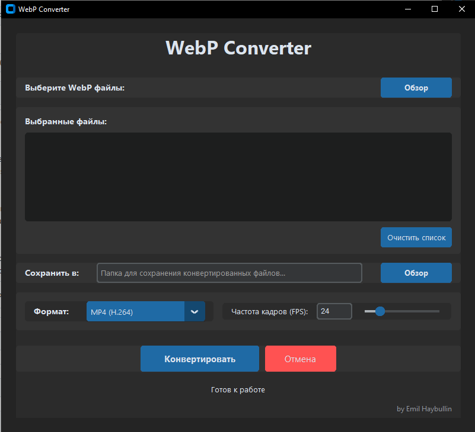
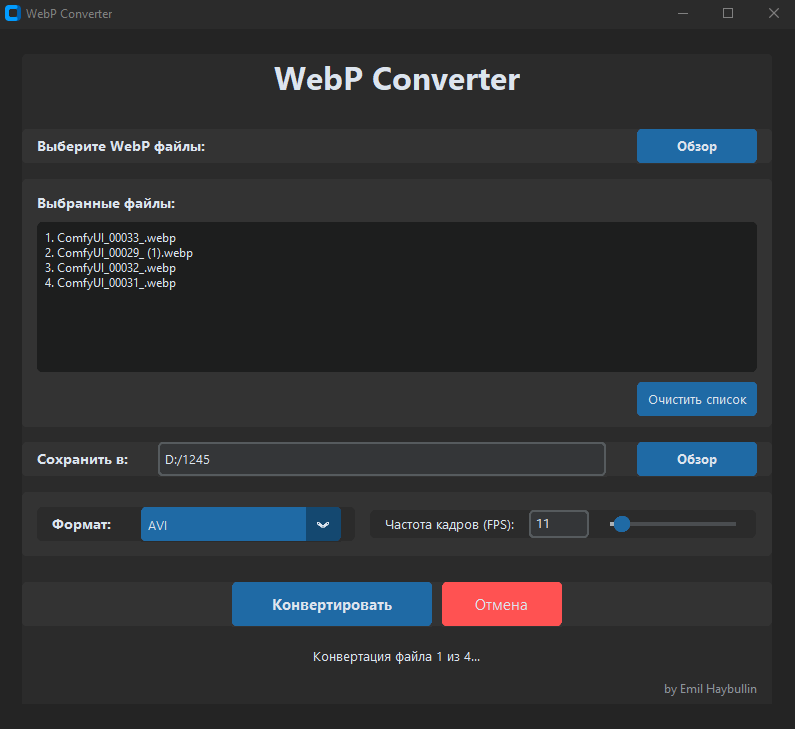

# WebP Converter 1.0.1 - Video Conversion Update

## 🎉 What's New
- Fixed video conversion issues
- Added better error handling
- Improved cross-platform compatibility
- Enhanced user interface feedback

## 🛠 Major Improvements
### Video Conversion
- Fixed critical 'NoneType' object error
- Added robust frame validation
- Improved temporary file management
- Enhanced codec handling for Windows and macOS

### Error Handling
- More detailed error messages
- Better recovery from conversion failures
- Improved resource cleanup
- Added comprehensive validation checks

### Platform Support
- Windows: Standardized libx264 codec
- macOS: Improved permissions handling
- Better cross-platform compatibility
- Enhanced file system access

## 📸 Screenshots

*Main application window with dark theme*

*File selection and queue management*

*Converting WebP animation to MP4*

## 💻 System Requirements
- Windows 10/11 (64-bit)
- macOS 10.15 or later
- 4GB RAM recommended
- 100MB free disk space

## 📥 Downloads
- Windows: [WebP-Converter-Windows.exe](download_link)
- macOS: [WebP-Converter-macOS.dmg](download_link)

## 🔍 Known Issues
- Some WebP animations might take longer to convert
- Progress bar may jump on large files

## 🙏 Feedback
If you encounter any issues or have suggestions, please open an issue on GitHub.
